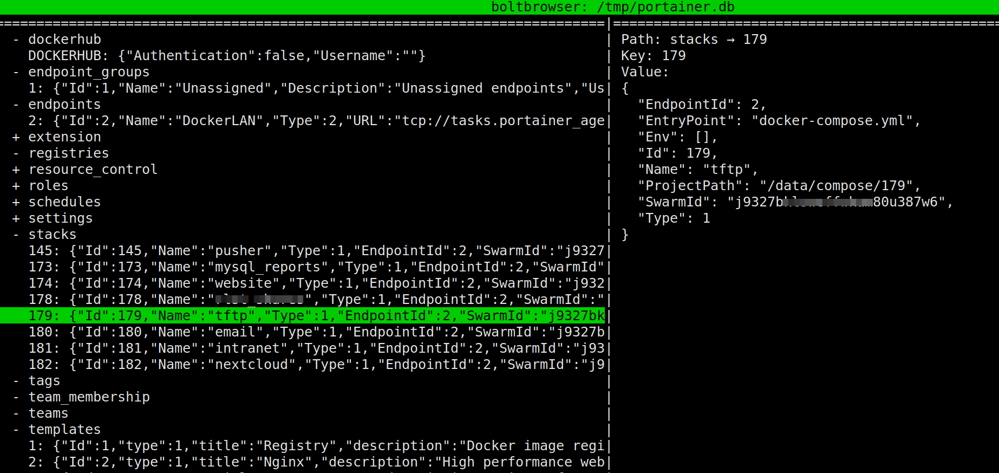

# Portainer Docker Stack
Docker compose file from the VERY AMAZING work of https://portainer.io developers!
From their home page: "Portainer is an open-source lightweight management ui which allows you to easily manage your docker hosts or swarm cluster".

This docker-compose.yml file is customized for our needs. Original file is from portainer.io repository (https://portainer.readthedocs.io/en/stable/deployment.html#inside-a-swarm-cluster).

## Requirements
* Docker initialized as swarm :  
`docker swarm init`
* Directory /srv/data/docker/containers/portainer/data created :  
`mkdir -p /srv/data/docker/containers/portainer/data`
* We use /srv/data/docker/var instead of /var/lib/docker, then keep attention on paths in this file

## Usage
* `curl -L https://raw.githubusercontent.com/Neomediatech/portainer-docker-stack/master/docker-compose.yml -o portainer-agent-stack.yml`
* `docker stack deploy --compose-file=portainer-agent-stack.yml Portainer`
* access your Portainer stack just deployed with a browser to http://ip-of-your-docker-host:9000

## What if I loose my swarm cluster?
If you recreate the swarm cluster you'll have a new swarm pair of token and id. There's no way (still at Jan 2020) to create a swarm cluster with custom token (see https://github.com/moby/moby/issues/25752 ).  
Portainer keep track of stack create in which swarm cluster, so if you create a new stack in the new swarm just created, and this stack has the same name of a previous stack, you'll receive an error indicating that you already have a stack with the same name (see https://github.com/portainer/portainer/issues/3023 ).  
__What to do?__  
Use [boltbrowser](https://github.com/br0xen/boltbrowser) to edit the portainer.db BoltDB database file, and delete all stacks.
(First stop portainer container)  
Press D (SHIFT + d) to delete the stack row. Repeat for all rows.  

